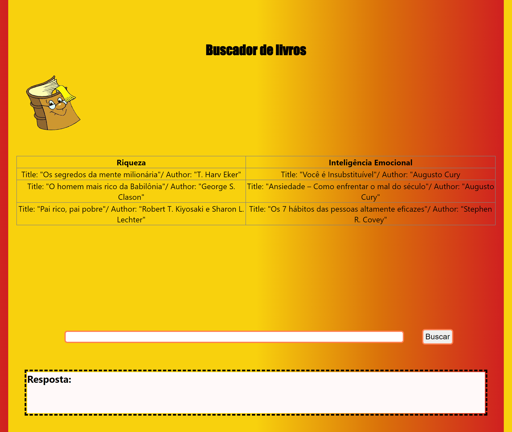

# Buscador de Livros

Neste projeto utilizei um array multimensional com os livros por categoria.

Ao digitar um nome e buscar, o script altera no array para buscar uma correspondência de retorno.

Também explorei alguns tipos de pesquisa e organização de arrays que você pode conferir no scripts.js.

